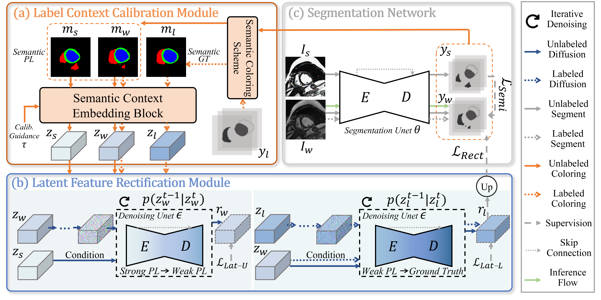

# DiffRect: Latent Diffusion Label Rectification for Semi-supervised Medical Image Segmentation

:pushpin: This is an official PyTorch implementation of **[MICCAI 2024]** - DiffRect: Latent Diffusion Label Rectification for Semi-supervised Medical Image Segmentation

> [**DiffRect: Latent Diffusion Label Rectification for Semi-supervised Medical Image Segmentation**](https://arxiv.org/abs/2407.09918)<br>
> [Xinyu Liu](https://xinyuliu-jeffrey.github.io/), [Wuyang Li](https://wymancv.github.io/wuyang.github.io/), [Yixuan Yuan](http://www.ee.cuhk.edu.hk/~yxyuan/)<br>The Chinese Univerisity of Hong Kong

[paper](https://arxiv.org/abs/2407.09918)

We propose DiffRect, a diffusion-based framework for semi-supervised medical image segmentation. It comprises two modules: the LCC aims to calibrate the biased relationship between classes in pseudo labels by learning category-wise correlation, and the LFR models the consecutive transportations between coarse to fine and fine to precise distributions of the pseudo labels accurately with latent diffusion.

<div align="center">
    
</div>

## News

**[2024.7]** :newspaper: Code and paper of DiffRect are released.

## Get Started

Here we provide setup, training, and evaluation scripts.

### Installation

Prepare the conda environment for DiffRect with the following command:
```bash
git clone https://github.com/CUHK-AIM-Group/DiffRect
cd DiffRect
conda create -n diffrect python=3.10
conda activate diffrect
pip install -r requirements.txt
mkdir datasets
```

### Data preparation

ACDC: Download from [ACDC](https://github.com/HiLab-git/SSL4MIS/tree/master/data/ACDC).

MS-CMRSEG19: Download from [official link](https://zmiclab.github.io/zxh/0/mscmrseg19/) or directly use our preprocessed data at [onedrive](https://mycuhk-my.sharepoint.com/:f:/g/personal/1155195604_link_cuhk_edu_hk/Eh0O786sCE1KuaASgpxYmj0ByM-Vqwlz3MqPdbD62Fg3KA?e=U7CltC).

Task05 Prostate: Download from [official link](http://medicaldecathlon.com/) or directly use our preprocessed data at [onedrive](https://mycuhk-my.sharepoint.com/:f:/g/personal/1155195604_link_cuhk_edu_hk/Eh0O786sCE1KuaASgpxYmj0ByM-Vqwlz3MqPdbD62Fg3KA?e=U7CltC).

Make your data in the following structure:
```
datasets/
├── ACDC/
│   ├── data/
│   │   ├── patient001_frame01.h5
│   │   ├── ...
│   │   └── slices/
│   │       ├── patient001_frame01_slice_1.h5
│   │       └── ...
│   ├── test.list
│   ├── train.list
│   ├── train_slices.list
│   └── val.list
├── mscmrseg19_split1/
│   ├── data/
│   │   ├── patient1_LGE.h5
│   │   ├── ...
│   │   └── slices/
│   │       ├── patient1_LGE_slice_0.h5
│   │       └── ...
│   ├── test.list
│   ├── train_slices.list
│   └── val.list
├── mscmrseg19_split2/
│   ├── data/
│   │   ├── patient1_LGE.h5
│   │   ├── ...
│   │   └── slices/
│   │       ├── patient1_LGE_slice_0.h5
│   │       └── ...
│   ├── test.list
│   ├── train_slices.list
│   └── val.list
├── Task05_split1/
│   ├── data/
│   │   ├── prostate_00.h5
│   │   ├── ...
│   │   └── slices/
│   │       ├── prostate_00_slice_0.h5
│   │       └── ...
│   ├── test.list
│   ├── train_slices.list
│   └── val.list
├── Task05_split2/
│   ├── data/
│   │   ├── prostate_00.h5
│   │   ├── ...
│   │   └── slices/
│   │       ├── prostate_00_slice_0.h5
│   │       └── ...
│   ├── test.list
│   ├── train_slices.list
│   └── val.list
```

For MS-CMRSEG19 and Task05, we report the results of the average of the two random splits.

**Note**: The data must be used for research purposes only and in accordance with the conditions set by the original data owners. We may disable the download link for our preprocessed data if requested by the original owners.

### Training

You can train DiffRect easily by specifying the GPU id, experiment name, number of labeled data, number of classes, and root data path. For example, on **ACDC** dataset that have **4** classes with **1\%** labeled data:
```bash
CUDA_VISIBLE_DEVICES=0 python train_diffrect_ACDC.py --exp ACDC/diffrect --labelnum 1 --num_classes 4 --root_path ./datasets/ACDC
```

The trained model and logs will be saved to ```logs/ACDC/diffrect_1_labeled```. 

### Testing

You can test DiffRect by the following command. For example, to test the above trained model on **ACDC**:
```bash
CUDA_VISIBLE_DEVICES=0 python test_2D.py --ckpt ./logs/ACDC/diffrect_1_labeled/unet/unet_best_model.pth --num_classes 4
```

## Model Zoo

To be released

## Citation

If you find our project is helpful, please feel free to leave a star and cite our paper:
```BibTeX
@InProceedings{liu2024diffrect,
    title     = {DiffRect: Latent Diffusion Label Rectification for Semi-supervised Medical Image Segmentation},
    author    = {Liu, Xinyu and Li, Wuyang and Yuan, Yixuan},
    booktitle = {International Conference on Medical Image Computing and Computer-Assisted Intervention},
    year      = {2024},
}
```

## Acknowledgement

We sincerely appreciate [SSL4MIS](https://github.com/HiLab-git/SSL4MIS), [guided-diffusion](https://github.com/openai/guided-diffusion), [GSS](https://github.com/fudan-zvg/GSS), [DiffUNet](https://github.com/ge-xing/Diff-UNet) for their awesome codebases. If you have any questions, contact xinyuliu@link.cuhk.edu.hk or open an issue.

## License

- [License](./LICENSE)
